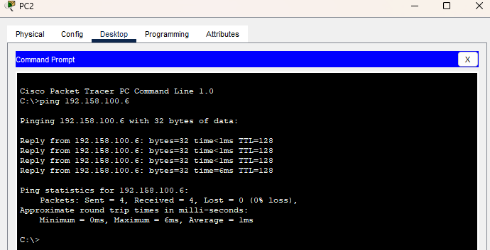

# Tarea #3 - VLANs y Protocolo VTP
**Estudiante:** José Daniel Guzmán Hernández

**Carnet:** 202111612  


---

## 1. Scripts de Configuración

### 1.1 Configuración VTP

#### Switch Servidor:
```bash
enable
configure terminal
hostname servidor
vtp mode server
vtp version 2
vtp domain 202111612
vtp password 202111612
exit
write memory
```

#### Switch Transparente:
```bash
enable
configure terminal
hostname transparente
vtp mode transparent
vtp version 2
vtp domain 202111612
vtp password 202111612
exit
write memory
```

#### Switch Cliente01:
```bash
enable
configure terminal
hostname cliente01
vtp mode client
vtp version 2
vtp domain 202111612
vtp password 202111612
exit
write memory
```

#### Switch Cliente02:
```bash
enable
configure terminal
hostname cliente02
vtp mode client
vtp version 2
vtp domain 202111612
vtp password 202111612
exit
write memory
```

### 1.2 Creación de VLANs (en Switch Servidor)

```bash
enable
configure terminal

vlan 12
name ADMON
exit

vlan 22
name MERCA
exit

vlan 32
name VENTAS
exit

write memory
```

### 1.3 Configuración de Puertos Trunk

#### En todos los switches (ajustar puertos según topología):
```bash
enable
configure terminal


interface fastethernet 0/1
switchport mode trunk
switchport trunk allowed vlan all
no shutdown
exit


interface fastethernet 0/2
switchport mode trunk
switchport trunk allowed vlan all
no shutdown
exit

write memory
```

### 1.4 Asignación de PCs a VLANs

#### Switch Cliente01:
```bash
enable
configure terminal

# PC1 → VLAN 12 (ADMON)
interface fastethernet 0/3
switchport mode access
switchport access vlan 12
exit

# PC2 → VLAN 22 (MERCA)
interface fastethernet 0/4
switchport mode access
switchport access vlan 22
exit

# PC3 → VLAN 32 (VENTAS)
interface fastethernet 0/5
switchport mode access
switchport access vlan 32
exit

write memory
```

#### Switch Cliente02:
```bash
enable
configure terminal

# PC4 → VLAN 12 (ADMON)
interface fastethernet 0/3
switchport mode access
switchport access vlan 12
exit

# PC5 → VLAN 22 (MERCA)
interface fastethernet 0/4
switchport mode access
switchport access vlan 22
exit

# PC6 → VLAN 32 (VENTAS)
interface fastethernet 0/5
switchport mode access
switchport access vlan 32
exit

write memory
```

---

## 2. Capturas de Verificación

### 2.1 Show VTP Status

#### Switch Servidor:


#### Switch Transparente:


#### Switch Cliente01:


#### Switch Cliente02:


### 2.2 Show VLAN Brief

#### Switch Servidor:


#### Switch Transparente:


#### Switch Cliente01:


#### Switch Cliente02:


---

## 3. Pruebas de Conectividad

### 3.1 Configuración de IPs

| PC | Switch | Puerto | VLAN | IP Address |
|---|---|---|---|---|
| PC1 | Cliente01 | Fa0/3 | 12 (ADMON) | 192.158.100.1/24 |
| PC2 | Cliente01 | Fa0/4 | 22 (MERCA) | 192.158.100.2/24 |
| PC3 | Cliente01 | Fa0/5 | 32 (VENTAS) | 192.158.100.3/24 |
| PC4 | Cliente02 | Fa0/3 | 12 (ADMON) | 192.158.100.4/24 |
| PC5 | Cliente02 | Fa0/4 | 22 (MERCA) | 192.158.100.5/24 |
| PC6 | Cliente02 | Fa0/5 | 32 (VENTAS) | 192.158.100.6/24 |

### 3.2 Pruebas Exitosas (Misma VLAN)

#### PC1 → PC4 (VLAN 12 - ADMON):


#### PC2 → PC5 (VLAN 22 - MERCA):


#### PC3 → PC6 (VLAN 32 - VENTAS):


### 3.3 Pruebas Fallidas (Diferentes VLANs)

#### PC1 → PC2 (VLAN 12 → VLAN 22):


#### PC1 → PC3 (VLAN 12 → VLAN 32):


#### PC2 → PC3 (VLAN 22 → VLAN 32):


---


---

## 5. Topología de Red


Descripción:
- 4 switches 2960: servidor, transparente, cliente01, cliente02
- Conexiones:
  * servidor ↔ transparente
  * transparente ↔ cliente01
  * transparente ↔ cliente02  
  * cliente01 ↔ cliente02
- 6 PCs: 3 en cliente01, 3 en cliente02


---

## 6. Conclusiones

1. **VTP (VLAN Trunking Protocol)** permite la propagación automática de información de VLANs entre switches.

2. **Modos VTP:**
   - **Servidor**: Crea, modifica y propaga VLANs
   - **Cliente**: Recibe información de VLANs del servidor
   - **Transparente**: No participa en VTP pero permite el paso de información

3. **Segmentación de red:** Las VLANs permiten segmentar la red lógicamente, evitando comunicación no autorizada entre diferentes departamentos.

4. **Trunks:** Son esenciales para transportar múltiples VLANs entre switches.

---

